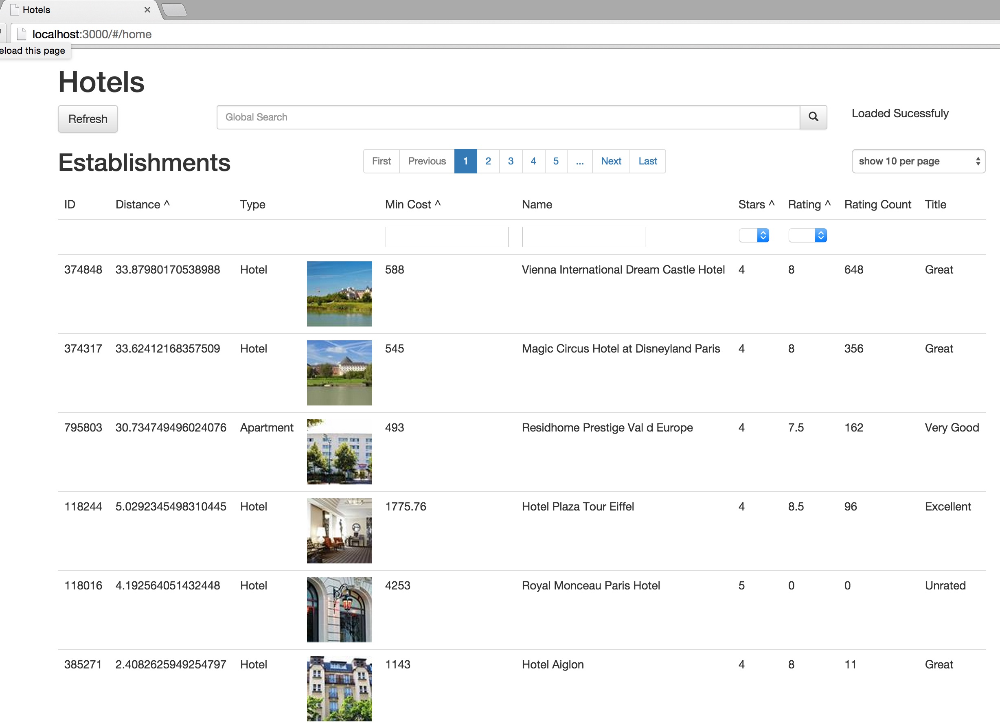

# Hotels

How to Run 
Install node.js then install the express plugin 
<em>npm install express</em> // this is required for serving static files

run the node server by typing in console:  
<em>node server</em> 
then point your borwser to: 
http://localhost:3000 

